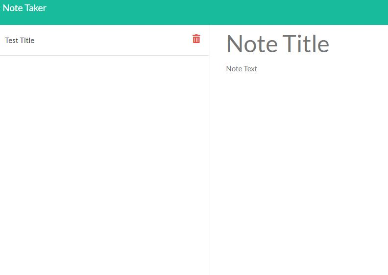
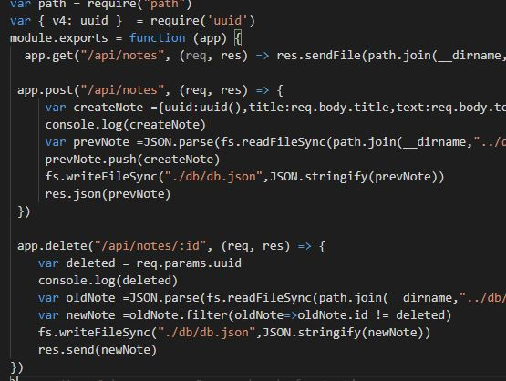

# Note Taker

Note Taker is a small application for saving and recording notes! Have a shooping list/ a to do item, or even in the mood for a short story. This application lets you note-it-all!
            




      
*  [Note-Taker Repository](https://github.com/chages16/Notetaker)
*  [Note-Taker Heroku](https://notetaker-chage.herokuapp.com/)


 ## Contents
            
* [User-Story](#User-Story)
            
* [Installation](#Installation)
            
* [Technology](#Technology)
            
* [Challenges](#Challenges)
            
* [Version](#Version)
            
* [Future-Development](#Future-Development)

* [Credits](#Credits)

## User-Story
```
AS A user, I want to be able to write and save notes

I WANT to be able to delete notes I've written before

SO THAT I can organize my thoughts and keep track of tasks I need to complete
```

## Installation
            
You can install the system by cloning the repository onto your home computer. Then, by using git bash from the root folder, install the required dependencies with npm install- and open the application with node server.js

## Technology

* [NPM Inquirer](https://www.npmjs.com/package/inquirer)

* [Node.js](https://nodejs.org/en/)

* [Visual Studio](https://code.visualstudio.com/)

* [NPM Express](https://www.npmjs.com/package/express)

## Challenges


## Version
1.0.0


## Future-Development
* Change the HTML and CSS to make it mine- different from the default.
* Fix the bugs-- 
* 


## Credits
* [Chris Hage](https://github.com/chages16)
